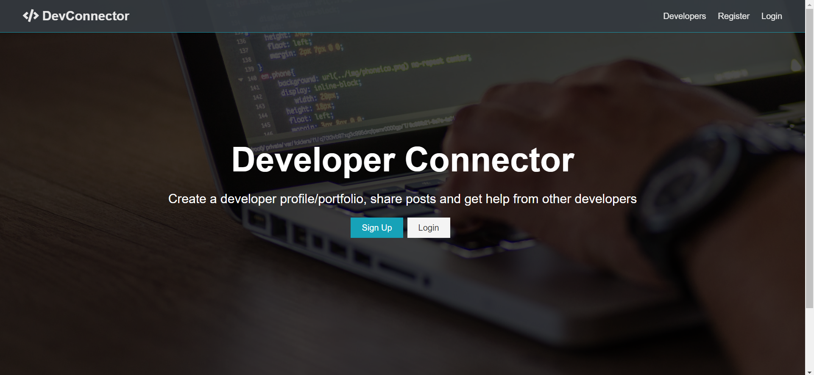

## About The Project

This project is part of learning full stack course on udemy using MERN stack. In this course there are two important parts,
* First is back-end, by using express, express is a minimal and flexible Node.js web application framework. You can learn more about express framwork by this link [Express.js](https://expressjs.com/)
* Second is fron-end, by using react, react is javaScript library created by Jordan Walke, a software engineer at Facebook. You can learn more about react by this link [React.js](https://reactjs.org/)

## objective
* To improve knowledge about HTTP and Web Service
* To learning a tools that create awesome products.

If you are interest in this project you can try to learn more by your self at
* [MERN Stack Course on Udemy](https://www.udemy.com/course/mern-stack-front-to-back/)
